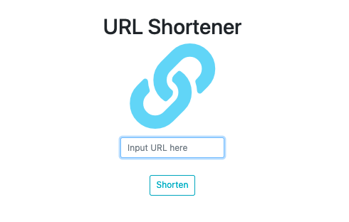

# URL Shortener

## Features
- You can input an url and get a new shorten url with 5 characters, which includes numbers or english characters
- You can click pin image to go back to previous page

## What I used
- express: 4.17.1, express-handlebars: 5.3.3, method-override: 3.0.0
- Bootstrap, jQuery, Popper.js and Font Awesome
- mongoose 6.0.4

## How to Use
- git clone git@github.com:carolebot/shorturl.git
- open your terminal
- `cd` to this project file
- type `npm install`
- type `npm run dev` to start 
- You will see `running on http://localhost:3000` 
- Input http://localhost:3000 on your browser 
